# Group 3: Code Completion
**Paper replicating:** [Pythia: AI-assisted Code Completion System](https://arxiv.org/abs/1912.00742)  
**Dataset:** [150k Python Dataset](https://www.sri.inf.ethz.ch/py150)

#### Dataset statistics
Python150 marks 100k files as training files and 50k files as evaluation/test files. Using a [deduplication tool](https://github.com/saltudelft/CD4Py) the original files were deduplicated resulting in **84728** training files and **42372** test files.  

In the preprocessing phase files which couldn't be parsed to an AST (e.g. because the Python version was too old) were removed. This reduced the training files to **75183** AST's. From these AST's a vocabulary of tokens is built using a threshold of `20`. This means that tokens which occur in the training set more than 20 times will be added to the vocabulary. This resulted in a vocabulary of size **43853**. 

## Experiments
Shared parameters:
```
batch size: 64
embed dimension: 150
hidden dimension: 500
num LSTM layers: 2
lookback tokens: 100
norm clipping: 10
initial learning rate: 2e-3
learning rate schedule: decay of 0.97 every epoch
epochs: 15
```

Deployed code: [experiments release](https://github.com/serg-ml4se-2020/group3-code-completion/releases/tag/experiments)

**Data used:**  
Training set (1970000 items): [download here](https://drive.google.com/file/d/1cARlxinp1y7bQqXBWbVLgJUdQ9lyJi9g/view?usp=sharing)  
Validation set (227255 items): [download here](https://drive.google.com/file/d/1EObNu3m24id-t60nK8hxqSZnhhsmWQRu/view?usp=sharing)  
Evaluation set (911213 items): [download here](https://drive.google.com/file/d/1wh1viWN7q3XNJGljr6tWTubMW6bYTRaj/view?usp=sharing)  
Vocabulary (size: 43853): [download here](https://drive.google.com/file/d/132HLLacrL_lWZfnYmRORtldkUpMb1Jgh/view?usp=sharing)

### Experiment 1 | Regularization - L2 regularizer
L2 parameter of `1e-6` [(also done here)](https://arxiv.org/abs/1701.06548).

|                | **Top-1 accuracy** | **Top-5 accuracy** |
|----------------|----------------|----------------|
| Validation set |        46.61%  |        71.67%  |
| Evaluation set |        47.89%  |        69.76%  |

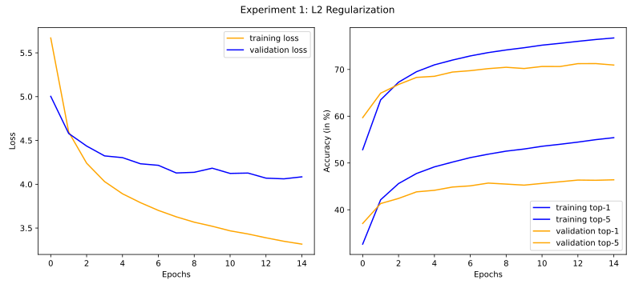

Resulting model: [final_model_experiment_1](https://drive.google.com/file/d/1zZdN5fg3bHD1e_hp1WMOe4J_EM_vAfz3/view?usp=sharing)
### Experiment 2 | Regularization - Dropout

Dropout parameter of `0.8` (based on Pythia).

|                | **Top-1 accuracy** | **Top-5 accuracy** |
|----------------|----------------|----------------|
| Validation set |        38.53%       |        63.31%       |
| Evaluation set |         39.37%      |        61.15%       |

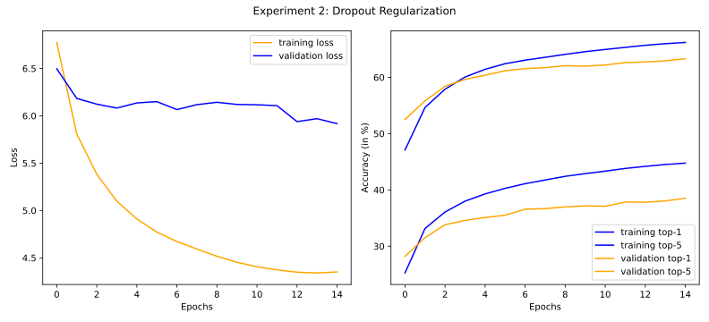

Resulting model: [final_model_experiment_2](https://drive.google.com/file/d/1rOGaq_FIOBhzKCppi8Tr8bZdhH65Nt1K/view?usp=sharing)
### Experiment 3 | No regularization
No L2, dropout or weighted loss.

|                | **Top-1 accuracy** | **Top-5 accuracy** |
|----------------|----------------|----------------|
| Validation set |        43.03%       |        67.37%       |
| Evaluation set |         46.63%      |        68.67%       |

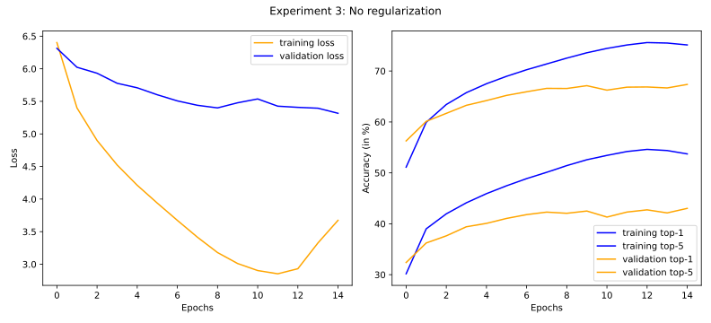

Resulting model: [final_model_experiment_3](https://drive.google.com/file/d/1x6YWdyZLNowmyWGMcpQdvHvfWzGzxDyi/view?usp=sharing)
### Experiment 4 | Regularization - Weighted loss + L2

Includes a weighted loss + L2  (`1e-6`).

|                | **Top-1 accuracy** | **Top-5 accuracy** |
|----------------|----------------|----------------|
| Validation set |        40.53%       |        63.62%       |
| Evaluation set |        41.31%       |        60.84%       |

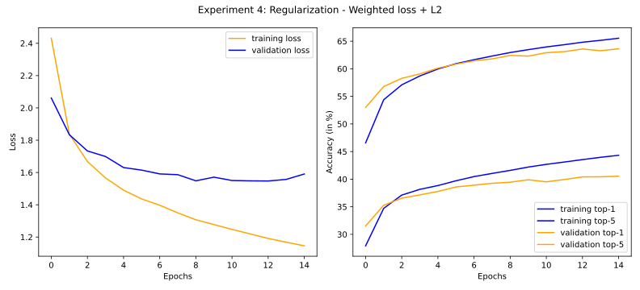

Resulting model: [final_model_experiment_4](https://drive.google.com/file/d/1icevmNV0Bj1sdI2UMUG25L8e6iCp-qmd/view?usp=sharing)
### Experiment 5 | bi-directional LSTM

Using a bi-directional LSTM instead of uni-directional. Also includes L2 regularizer  (`1e-6`). 

|                | **Top-1 accuracy** | **Top-5 accuracy** |
|----------------|----------------|----------------|
| Validation set |        48.60%       |        71.49%       |
| Evaluation set |        49.87%       |        70.11%       |


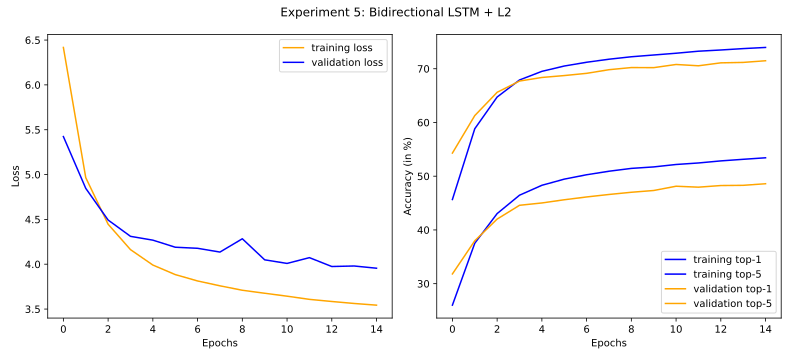

Resulting model: [final_model_experiment_5](https://drive.google.com/file/d/1hM3HE-xNJLdCCc0gIO7CmC-Bglg9Or61/view?usp=sharing)

### Experiment 6 | attention

Using an attention mechanism. Also includes L2 regularizer. 

|                | **Top-1 accuracy** | **Top-5 accuracy** |
|----------------|----------------|----------------|
| Validation set |        51.10%       |        73.95%       |
| Evaluation set |        52.90%       |        72.86%       |


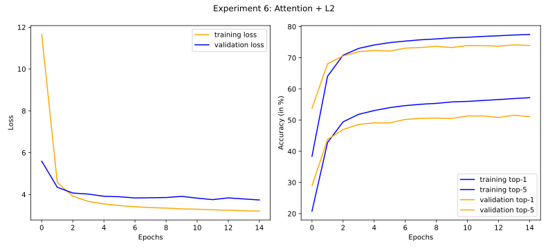

Resulting model: [final_model_experiment_6](https://drive.google.com/file/d/14S0b3CJlU3lF3Z9mByCAEMSFKx2xygd6/view?usp=sharing)

### Experiment 7 | attention

Using an attention mechanism. Also includes L2 regularizer (`1e-6`) and a (lower) dropout (`0.4`). 

|                | **Top-1 accuracy** | **Top-5 accuracy** |
|----------------|----------------|----------------|
| Validation set |        51.51%       |        74.17%       |
| Evaluation set |        53.70%       |        73.22%       |

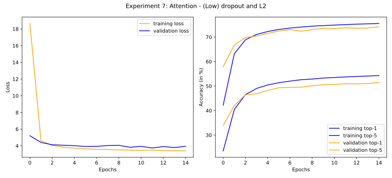

Resulting model: [final_model_experiment_7](https://drive.google.com/file/d/1aYZk2WrjSCKca-V5h_dWYVmU4nABN2X6/view?usp=sharing)
### Experiment 8 | Regularizer - (low) dropout

Includes L2 regularizer (`1e-6`) and a (lower) dropout (`0.4`)

|                | **Top-1 accuracy** | **Top-5 accuracy** |
|----------------|----------------|----------------|
| Validation set |        47.31%       |        71.89%       |
| Evaluation set |        48.56%       |        70.71%       |

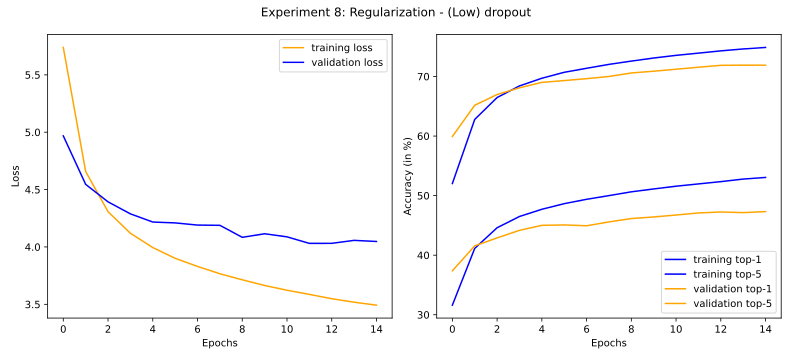
Resulting model: [final_model_experiment_8](https://drive.google.com/file/d/12OL-xGfMvmEfOdB78KyjQhDkKjjhyLgS/view?usp=sharing)

### Experiment 9 | Attention different

Includes L2 regularizer (`1e-6`) and a (lower) dropout (`0.4`)

|                | **Top-1 accuracy** | **Top-5 accuracy** |
|----------------|----------------|----------------|
| Validation set |        50.67%       |        73.38%       |
| Evaluation set |        52.69%%       |        72.36%       |


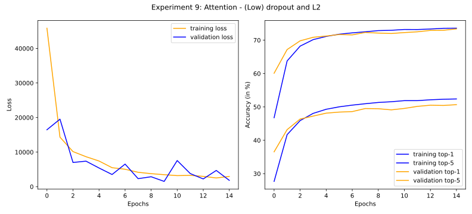
Resulting model: [final_model_experiment_9](https://drive.google.com/file/d/1kJiJ2ELB6DdyYmTX4VrTGoU2SBdE5JSE/view?usp=sharing)

### Experiment 10 | Attention final

Includes L2 regularizer (`1e-6`) and a (lower) dropout (`0.4`). Runs for 30 epochs.

|                | **Top-1 accuracy** | **Top-5 accuracy** |
|----------------|----------------|----------------|
| Validation set |        52.20%       |        75.12%       |
| Evaluation set |        54.80%       |        74.51%       |


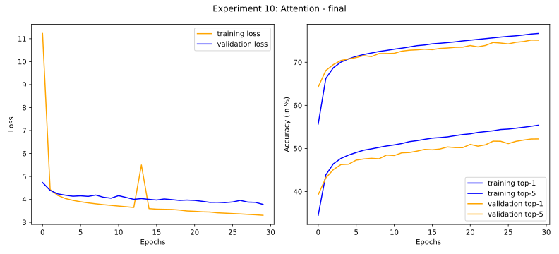
Resulting model: [final_model_experiment_10](https://drive.google.com/file/d/1bGv8a_2Qhh1urN8r0S0wUluL8KYvDt4I/view?usp=sharing)

### Experiment 11 | Best regularizer

Includes L2 regularizer (`1e-6`) and a (lower) dropout (`0.4`).

|                | **Top-1 accuracy** | **Top-5 accuracy** |
|----------------|----------------|----------------|
| Validation set |        47.26%       |        71.96%       |
| Evaluation set |        48.51%       |        70.60%       |


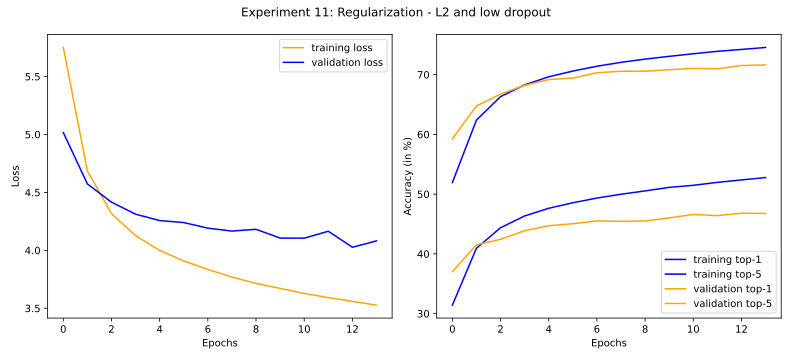
Resulting model: [final_model_experiment_11](https://drive.google.com/file/d/1AatStOh3P-a3e7qWCYyK0I_FiR-AYQrz/view?usp=sharing)
